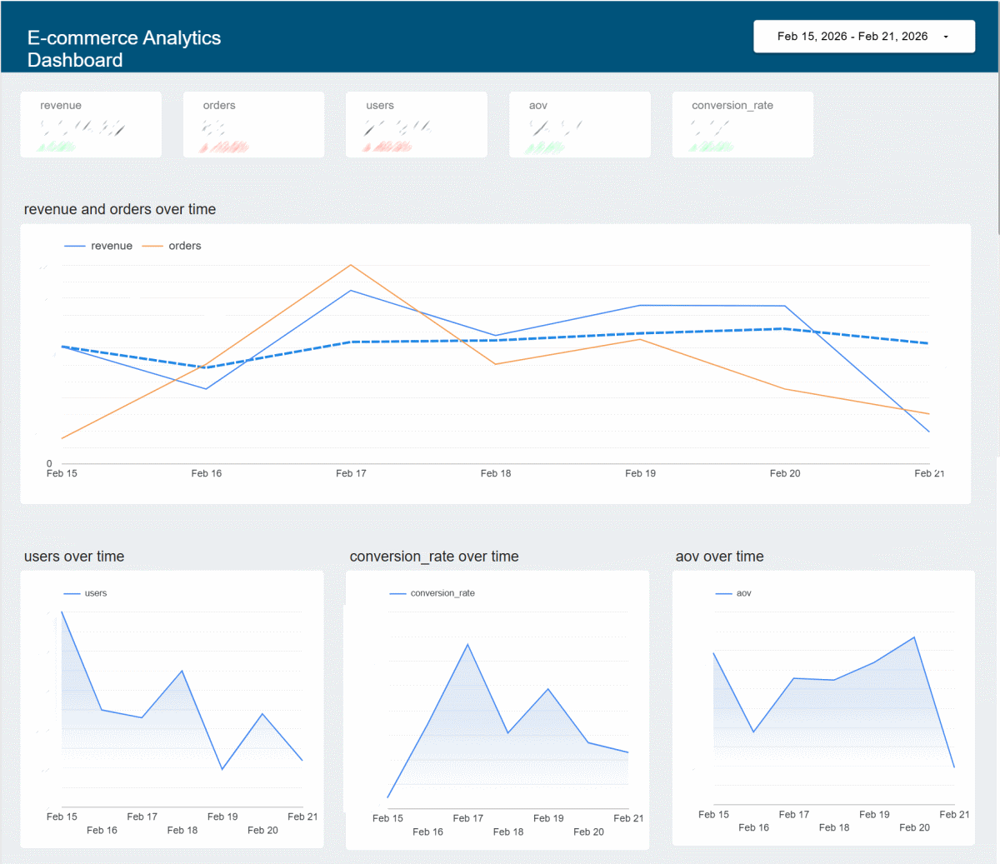
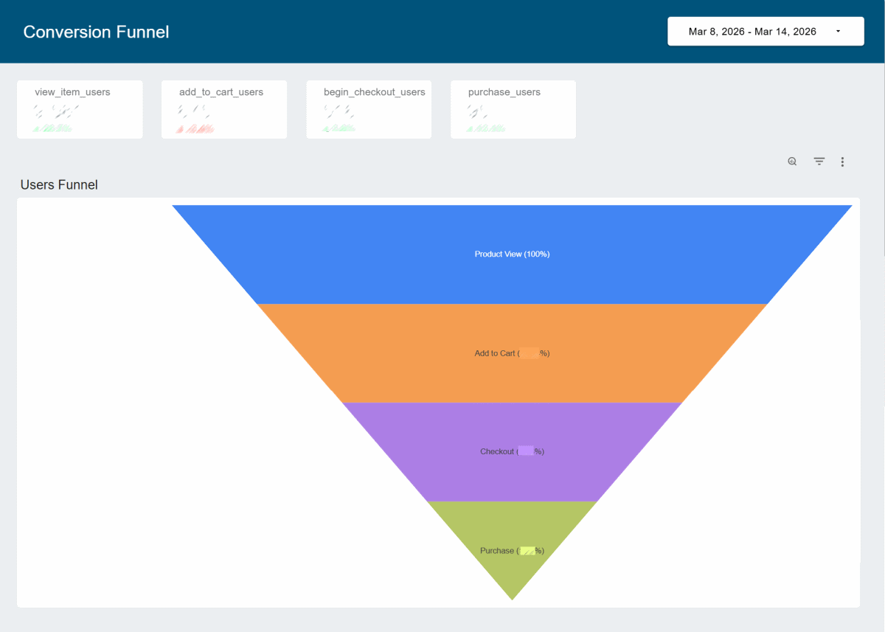
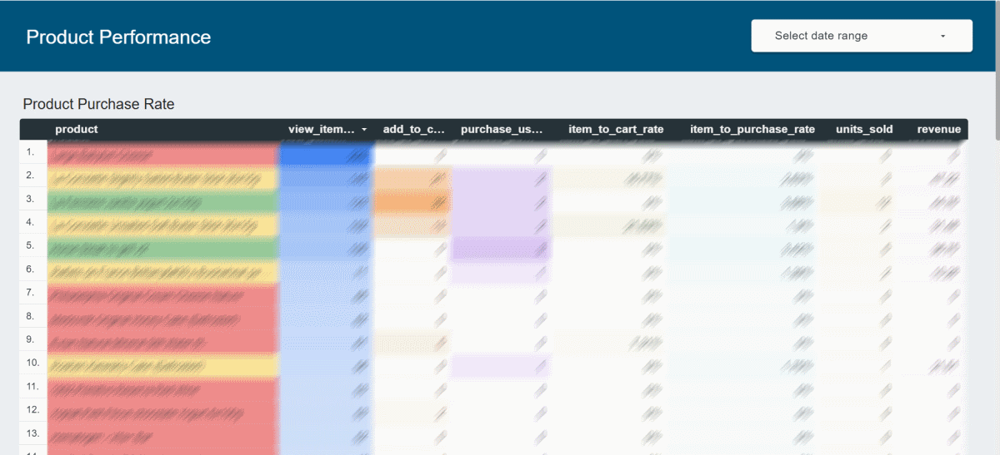
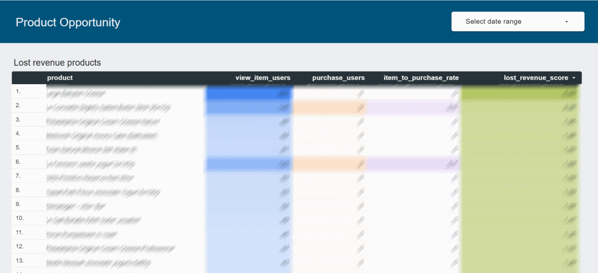
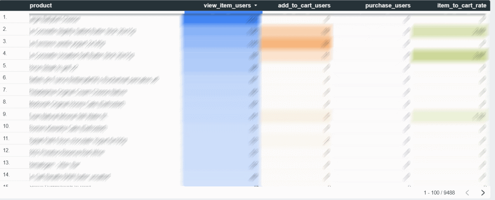
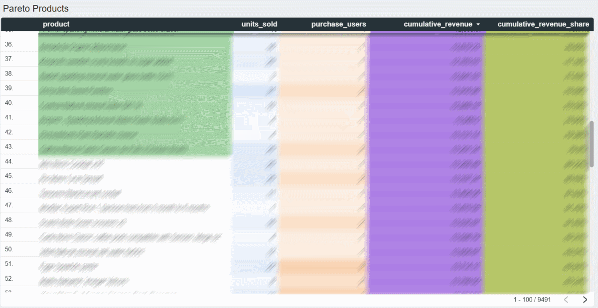
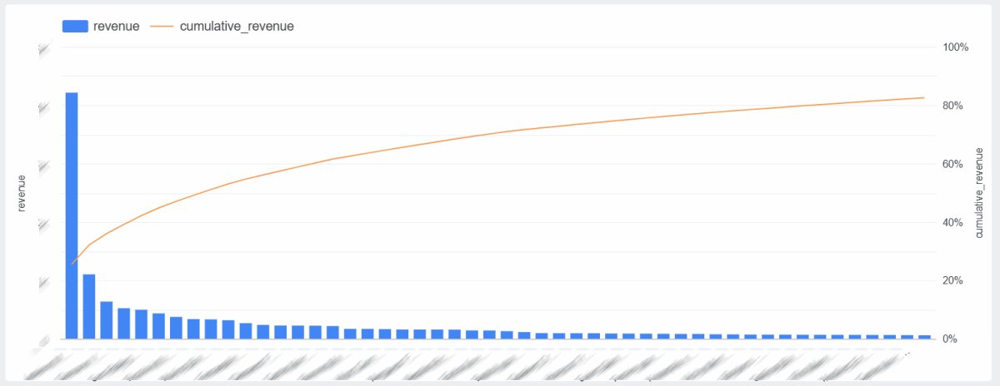
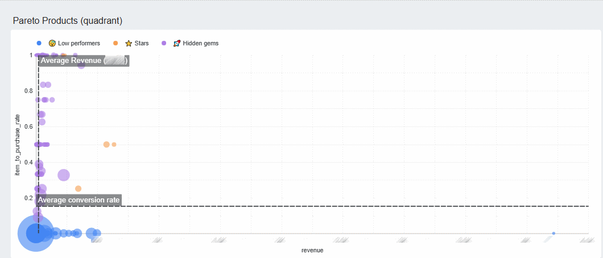

# GA4 eCommerce Dashboard (GA4 → BigQuery → Looker Studio)



This project demonstrates how raw **Google Analytics 4 export data in BigQuery** can be transformed into structured eCommerce analytics datasets and visualized in a **Looker Studio dashboard**.

The goal of this project is to build a practical analytics layer for an eCommerce business that allows analysts and marketers to monitor revenue performance, product performance, marketing channels, and conversion funnels.

The project includes **SQL transformations in BigQuery** and a **Looker Studio dashboard** built on top of these datasets.

---

## Project Architecture

GA4 exports raw event data into BigQuery.  
However, the data is nested and not directly suitable for analytics.

This project transforms the raw event data into structured tables that can be easily used for reporting and dashboards.

**Data flow**

GA4 → BigQuery Raw Events → SQL Transformations → Analytics Tables → Looker Studio Dashboard

---

## Data Source

**Google Analytics 4 BigQuery Export**

Example dataset structure:
analytics_xxxxx.events_*


GA4 data characteristics:

- event-based structure
- nested parameters
- nested product item arrays
- requires UNNEST operations

The SQL queries in this repository flatten and aggregate this data for analytics.

---

## Project Structure

```
.
├── dashboard
│   ├── overview.png
│   ├── conversion-funnel.png.png
│   ├── product-performance.png
|   ├── zero-purchase-products-with-high-traffic.png
|   ├── lost-revenue-products.png
|   ├── pareto-products.png
|   ├── pareto-products-graph.png
│   └── pareto-products-quadrant.png

├── sql
│   ├── category_daily_ecommerce.sql
│   ├── channel_daily_ecommerce.sql
│   ├── customer_metrics_ecommerce.sql
│   ├── daily-kpi-ecommerce.sql
│   ├── funnel-sums-ecommerce.sql
│   ├── funnel_daily_table_ecommerce.sql
│   ├── ga4_core_metrics.sql
│   ├── product_performance.sql
│   └── product_conversion_ecommerce.sql

└── README.md
```

---

## SQL Transformations

### Core Metrics

**File:** `sql/ga4_core_metrics.sql`

Extracts core eCommerce metrics from GA4 events:

- revenue
- orders
- sessions
- conversion rate
- average order value

This dataset serves as the base for several dashboard components.

---

### Daily KPI Table

**File:** `sql/daily-kpi-ecommerce.sql`

Creates a daily aggregated table containing key performance indicators:

- revenue
- orders
- sessions
- conversion rate
- average order value

Used for time-series performance reporting.

---

### Product Performance

**File:** `sql/product_performance.sql`

Analyzes product-level metrics:

- product revenue
- quantity sold
- product views
- product conversion rate

Helps identify top-performing products.

---

### Product Conversion Analysis

**File:** `sql/product_conversion_ecommerce.sql`

Measures the conversion performance of individual products:

- product views
- add-to-cart events
- purchases
- product conversion rate

---

### Channel Performance

**File:** `sql/channel_daily_ecommerce.sql`

Evaluates marketing channel performance:

- revenue by channel
- orders by channel
- sessions by channel
- channel conversion rate

Useful for marketing attribution analysis.

---

### Category Performance

**File:** `sql/category_daily_ecommerce.sql`

Aggregates performance metrics by product category:

- category revenue
- category orders
- category conversion

Useful for merchandising analysis.

---

### Customer Metrics

**File:** `sql/customer_metrics_ecommerce.sql`

Analyzes customer behavior:

- new vs returning users
- revenue by user type
- order distribution

---

### Funnel Analysis

**Files**
sql/funnel_daily_table_ecommerce.sql
sql/funnel-sums-ecommerce.sql

Builds an eCommerce funnel based on GA4 events:

1. product view  
2. add to cart  
3. begin checkout  
4. purchase  

This allows measuring conversion rates between funnel stages.

---

## Looker Studio Dashboard

The Looker Studio dashboard visualizes the datasets created in BigQuery.

Main dashboard pages include:

- Overall eCommerce performance
- Product performance
- Marketing channel analysis
- Conversion funnel
- Customer insights

---

## Dashboard Screenshots

### Overview


### Conversion Funnel



### Product Performance



### Lost Revenue Products



### Product with high traffic but 0 purchases



### Pareto Products Table (80% of Revenue)



### Pareto Products Graph (80% of Revenue)



### Pareto Products Quadrant (80% of Revenue)


---

## Skills Demonstrated

This project demonstrates practical experience in:

- GA4 data modeling
- BigQuery SQL
- nested data processing (UNNEST)
- eCommerce analytics
- funnel analysis
- marketing attribution
- dashboard design
- Looker Studio reporting

---

## Future Improvements

Planned improvements include:

- building a unified **events_enriched table**
- customer lifetime value analysis
- cohort analysis
- marketing ROI reporting
- automated scheduled queries in BigQuery

---

## Author

Vasyl Tsyktor, Senior SEO Specialist & eCommerce Data Analyst  

Working with **GA4, BigQuery, SQL and Looker Studio** to build actionable analytics systems for eCommerce businesses.
